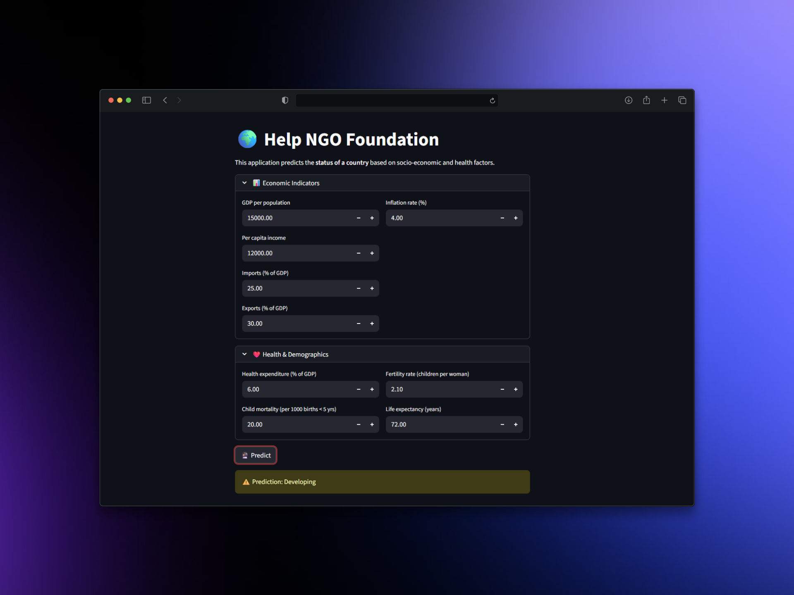

# 🌍 Health NGO Country Financial Support App

  

This is a Streamlit-based application built to support the **Help-Foundation**.  
It predicts the **development status of a country** (Developed, Developing, Underdeveloped) based on socio-economic and health indicators.

---

## 🚀 Features
- ✅ Predicts country status using a trained ML model.
- 📊 Considers **economic indicators** (GDP, per capita income, imports, exports, inflation).
- 🏥 Considers **health & demographic indicators** (health expenditure, child mortality, fertility rate, life expectancy).
- 🎨 Simple, interactive **Streamlit UI** with expanders and default values.
- 🎯 Result shown with **color-coded prediction**.

---

## 🛠️ Tech Stack
- **Python** 🐍
- **Streamlit** – for the web UI
- **NumPy & Pandas** – data handling
- **scikit-learn** (joblib, PCA, scaling, model) – ML preprocessing & classification
- **Trained ML Model** (saved as `final_model.joblib`)

---

